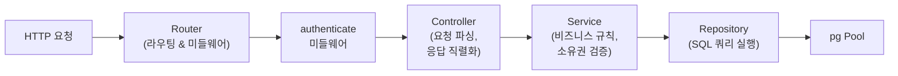
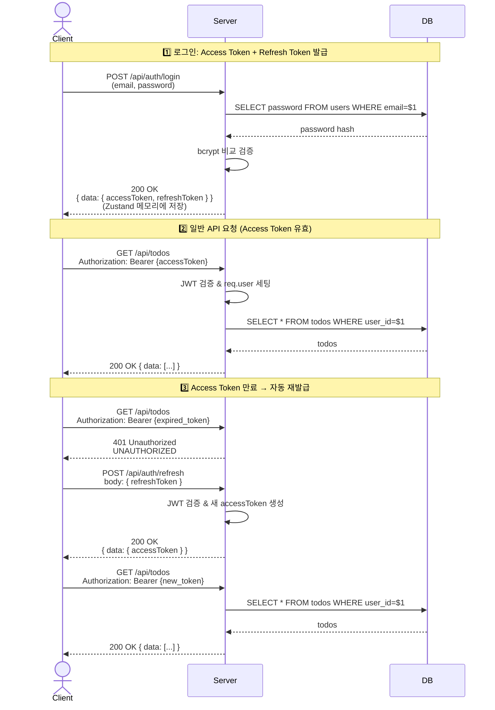
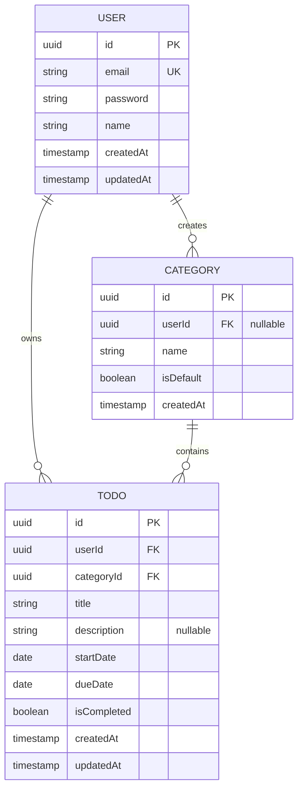

# TodolistApp 기술 아키텍처 다이어그램

**버전:** 1.0  
**작성일:** 2026-05-13  
**참조 문서:**
- 도메인 정의서 v1.2 (`1-domain-definition.md`)
- 아키텍처 설계 원칙 v1.0 (`4-architecture-principles.md`)

---

## 1. 시스템 전체 구조

클라이언트, 서버, 데이터베이스 간의 통신 경로와 인증 토큰 흐름을 나타냅니다.

```mermaid
graph TB
    client["🌐 클라이언트<br/>(React 19 + TypeScript)"]
    server["🖥️ 서버<br/>(Express REST API)"]
    db["💾 데이터베이스<br/>(PostgreSQL 17)"]
    
    client -->|HTTPS<br/>Authorization: Bearer {AccessToken}| server
    server -->|HTTPS<br/>Access Token + Refresh Token (응답 바디)| client
    server <-->|pg 라이브러리<br/>SQL 쿼리| db
    
    client -->|로그인 요청| server
    server -->|Access Token 만료 시<br/>Refresh Token으로 재발급| client
```

---

## 2. 백엔드 레이어 구조

HTTP 요청이 Router에서 시작하여 Controller → Service → Repository를 거쳐 데이터베이스에 도달하는 흐름입니다.



---

## 3. 인증 흐름 (시퀀스)

로그인, API 요청, Access Token 만료 후 자동 갱신의 3가지 시나리오를 나타냅니다.



---

## 4. ER 다이어그램 (엔티티 관계도)

3개의 핵심 엔티티와 그 관계를 나타냅니다.



---

## 주요 특징

### 인증 (Authentication)
- **Access Token:** JWT, 1시간 만료, Authorization 헤더로 전달
- **Refresh Token:** JWT, 7일 만료, 로그인 응답 바디로 수신 → Zustand 메모리 저장 → 재발급 시 요청 바디로 전송
- **자동 갱신:** 클라이언트 인터셉터가 401 응답 감지 후 Zustand의 Refresh Token으로 `/api/auth/refresh` 호출

### 데이터 격리
- 모든 데이터 조회는 `userId` 검증을 거쳐 사용자별로 격리됨
- Todo, Category의 소유권 검증은 Service 레이어에서 수행

### 기본 카테고리
- 시스템 DB 시딩으로 제공 (업무, 개인, 기타)
- `userId = NULL, isDefault = true`로 저장
- 모든 사용자가 공유하며 수정/삭제 불가

### 할일 필터링
- 카테고리, 완료 상태, 시작일-종료일 범위 필터 AND 조합 지원
- 모든 필터는 선택사항이며 클라이언트가 URL 쿼리 파라미터로 전달
