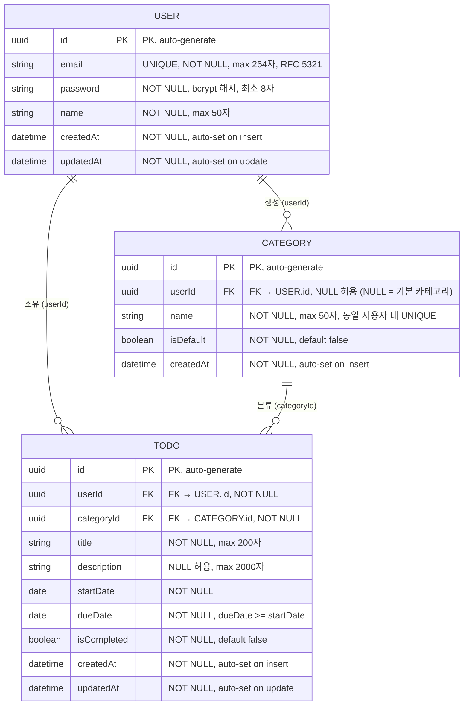

# TodolistApp ERD (Entity Relationship Diagram)

**버전:** 1.0  
**작성일:** 2026-05-13  
**참조 문서:** [도메인 정의서 v1.2](./1-domain-definition.md) · [PRD v1.2](./2-prd.md)

---

## ERD

---

## 관계 설명

| 관계 | 카디널리티 | 설명 |
|------|-----------|------|
| USER → TODO | 1 : N | 한 사용자는 여러 할일을 소유한다. 할일은 반드시 한 사용자에게 귀속된다 (BR-3.2.1) |
| USER → CATEGORY | 1 : N | 한 사용자는 여러 사용자 정의 카테고리를 생성할 수 있다 |
| CATEGORY → TODO | 1 : N | 한 카테고리에 여러 할일이 속할 수 있다. 할일은 반드시 하나의 카테고리를 가진다 (BR-3.2.3) |

---

## 주요 제약 조건

### 기본 카테고리
- `userId = NULL`, `isDefault = true` 인 레코드를 서버 기동 시 DB 시딩으로 생성
- 기본 카테고리 3종: `업무`, `개인`, `기타`
- 모든 사용자가 공유하며 수정·삭제 불가 (BR-3.3.1)

### 날짜 제약
- `TODO.dueDate >= TODO.startDate` 를 애플리케이션 레이어(Service)에서 검증 (BR-3.2.4)

### 데이터 격리
- 모든 TODO·사용자 정의 CATEGORY 조회는 `userId` 조건을 포함하여 사용자 간 데이터가 격리됨 (BR-3.2.2, BR-3.3.2)

### 삭제 제약
- CATEGORY 삭제 시 연결된 TODO가 존재하면 삭제 불가 (BR-3.3.3)
- 회원 탈퇴 시 해당 사용자의 TODO 및 사용자 정의 CATEGORY를 CASCADE 삭제, 기본 카테고리(`userId = NULL`)는 삭제되지 않음
