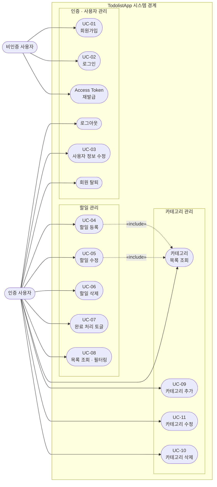

# TodolistApp 유스케이스 다이어그램

**버전:** 1.0  
**작성일:** 2026-05-13  
**참조 문서:** [PRD v1.2](./2-prd.md) · [도메인 정의서 v1.2](./1-domain-definition.md)

---

---

## 액터 정의

| 액터 | 설명 |
|------|------|
| 비인증 사용자 | 회원가입·로그인 전 상태 또는 Access Token이 만료된 상태의 사용자 |
| 인증 사용자 | 로그인 후 유효한 Access Token을 보유한 사용자 |

---

## 유스케이스 목록

### 인증 · 사용자 관리

| UC | 명칭 | 액터 | 관련 BR |
|----|------|------|---------|
| UC-01 | 회원가입 | 비인증 사용자 | BR-3.1.1, BR-3.1.2 |
| UC-02 | 로그인 | 비인증 사용자 | BR-3.1.2 |
| — | Access Token 재발급 | 비인증 사용자 | BR-3.1.2 |
| — | 로그아웃 | 인증 사용자 | — |
| UC-03 | 사용자 정보 수정 | 인증 사용자 | BR-3.1.3 |
| — | 회원 탈퇴 | 인증 사용자 | — |

### 할일 관리

| UC | 명칭 | 액터 | 관련 BR |
|----|------|------|---------|
| UC-04 | 할일 등록 | 인증 사용자 | BR-3.2.1, BR-3.2.3, BR-3.2.4 |
| UC-05 | 할일 수정 | 인증 사용자 | BR-3.2.2, BR-3.2.4 |
| UC-06 | 할일 삭제 | 인증 사용자 | BR-3.2.2 |
| UC-07 | 완료 처리 토글 | 인증 사용자 | BR-3.2.2, BR-3.2.5 |
| UC-08 | 목록 조회 · 필터링 | 인증 사용자 | BR-3.2.2 |

### 카테고리 관리

| UC | 명칭 | 액터 | 관련 BR |
|----|------|------|---------|
| — | 카테고리 목록 조회 | 인증 사용자 | BR-3.3.1, BR-3.3.2 |
| UC-09 | 카테고리 추가 | 인증 사용자 | BR-3.3.2 |
| UC-11 | 카테고리 수정 | 인증 사용자 | BR-3.3.1, BR-3.3.2 |
| UC-10 | 카테고리 삭제 | 인증 사용자 | BR-3.3.1, BR-3.3.3 |

---

## 관계 설명

| 관계 | From | To | 설명 |
|------|------|----|------|
| «include» | UC-04 할일 등록 | 카테고리 목록 조회 | 할일 등록 시 카테고리 선택을 위해 목록 조회 필수 |
| «include» | UC-05 할일 수정 | 카테고리 목록 조회 | 할일 수정 시 카테고리 변경을 위해 목록 조회 필수 |
